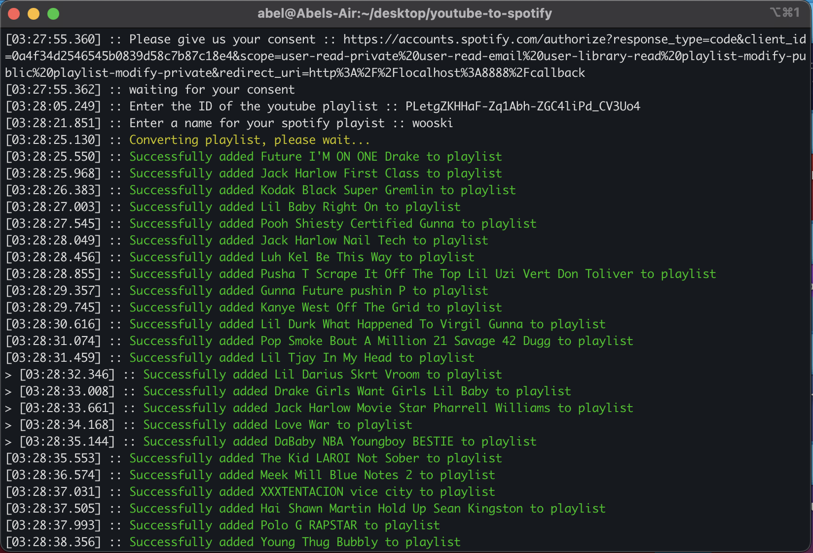

# Playlist Converter

a simple cli program that converts a youtube music playlist to a spotify playlist, this program automates this tedious process of having to manually add each playlist one by one. 




# Requirements
> Node && Git

## Installation
```bash
> git clone https://github.com/WarlordAbel/playlist-converter
> cd playlist-converter
> npm install
```

## Instructions

This project uses SpotifyOAuth, see [Spotify API documentation](https://developer.spotify.com/documentation/general/guides/authorization/)

Open the config json and you should some credentials that are needed in order for this program to work

To get your credentials create an account on [Spotify for Developers](https://developer.spotify.com/) and make sure to add the redirect_url on Dashboard > Edit Settings > Redirect URIs


This project also uses the Youtube API, get your Youtube API key from [Youtube API](https://cloud.google.com/) and open the config json file and input your Youtube API key. 


Now with everything set just run:

```bash
> npm start
```


If you find some issue fell free to open a [issue](https://github.com/0xAbel/playlist-converter/issues) or a [pull request](https://github.com/0xAbel/playlist-convereter/pulls)

## Todo
- [] Better error handling
- [] Web app

